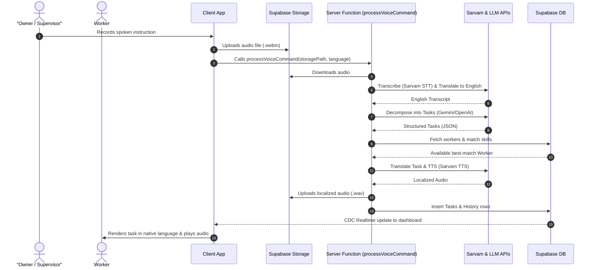
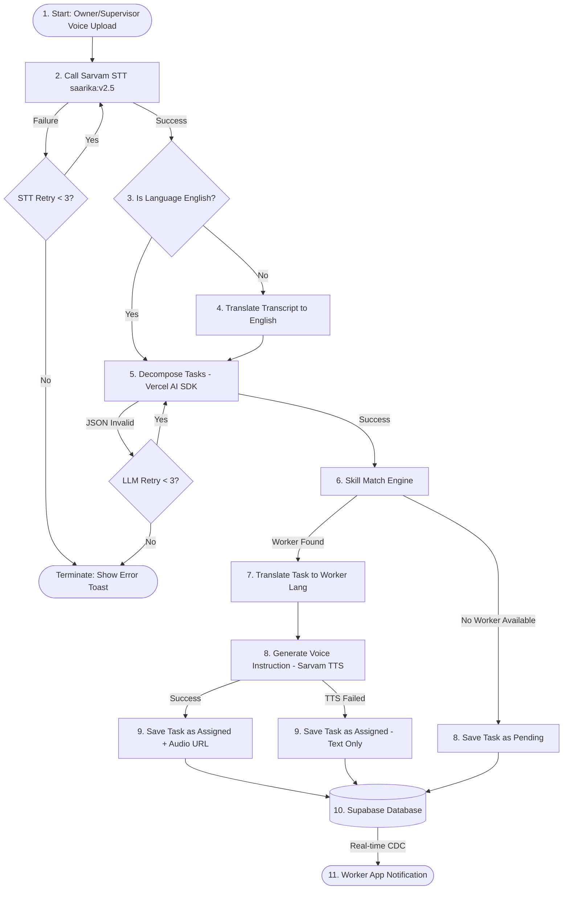
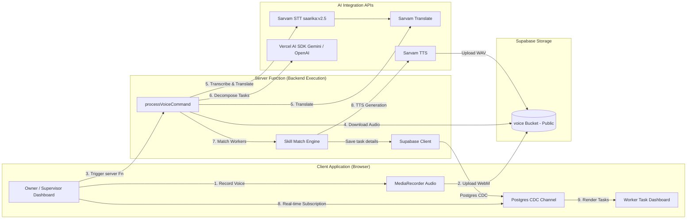

# AI Staff Broker — Multilingual AI Workforce Supervisor

AI Staff Broker is a voice-first, AI-driven workforce coordination and task delegation platform built for operational environments (e.g., warehouses, retail floors, factories, construction sites, and hospitals). 

Supervisors can record and upload instructions in their native language. The system's **Agentic AI Pipeline** transcribes the audio, automatically breaks the instruction down into granular tasks, prioritizes them, matches them to the most suitable available workers based on skill tagging, translates the tasks into the workers' preferred languages, and generates synthetic voice instructions for playback.

For a non-technical overview of the product, including a step-by-step user story and simple how-to-use instructions for managers and workers, check out the [Non-Technical User Guide](file:///c:/Users/vamsh/Downloads/lingua-task-main/lingua-task-main/docs/user_guide.md).

---

## 🏗️ System Architecture

AI Staff Broker is designed as a modern **full-stack SSR application** using the **TanStack Start** framework. It uses a serverless and real-time database architecture powered by **Supabase**.

### 1. Execution Sequence
The sequence below illustrates the step-by-step transaction flow during a supervisor's voice command:



### 2. Agentic State Pipeline (LangGraph-style)
This diagram illustrates the conditional logic, retries, and fallback strategies executed asynchronously within the Agent pipeline:



### 3. System Component Architecture
A simplified block diagram showing the layout of components and how data travels across client, storage, server, and external AI services:



### Key Architectural Layers:
1. **Frontend (Client/Hydrated Layer)**: Built with React, utilizing TanStack Router for type-safe routing and TanStack Query (v5) for cache-first client-side state synchronization.
2. **Server Layer (Server Functions)**: Utilizes TanStack Start Server Functions to execution-gate sensitive operations (database transactions, external AI API calls, file downloads/conversions) securely behind Supabase authentication.
3. **Database & Real-time Layer**: Supabase Postgres handles core relations and Row-Level Security (RLS) policies. Real-time changes are synchronized to active client dashboards via Postgres CDC (Change Data Capture) channels.
4. **AI Processing Layer**: An orchestration pipeline integrating Sarvam AI (for local Indic languages STT/Translation/TTS) and LLM providers (Google Gemini or OpenAI via Vercel AI SDK) for cognitive tasks.

---

## 🛠️ Technology Stack

- **Core Framework**: [React 19](https://react.dev/), [TypeScript](https://www.typescriptlang.org/), [TanStack Start](https://tanstack.com/router/v1/docs/start/overview)
- **Routing & State**: [TanStack Router](https://tanstack.com/router/v1), [TanStack Query v5](https://tanstack.com/query/latest)
- **Database, Auth & Storage**: [Supabase](https://supabase.com/) (Postgres DB, Supabase Auth, GoTrue, Real-time Subscriptions, Postgres CDC, Storage Buckets)
- **AI & LLM Integration**: [Vercel AI SDK](https://sdk.vercel.ai/docs), [OpenAI-Compatible Adapters](https://github.com/vercel/ai/tree/main/packages/openai-compatible)
- **Indic Voice & NLP Gateway**: [Sarvam AI](https://www.sarvam.ai/) (STT, TTS, and Translation supporting Indic languages)
- **Styling & Components**: CSS Modules, [TailwindCSS v4](https://tailwindcss.com/), [Radix UI Primitive Components](https://www.radix-ui.com/), [Lucide Icons](https://lucide.dev/)
- **Utility Libraries**: [Zod](https://zod.dev/) (runtime schema validation), [Sonner](https://emilkowalski.com/sonner) (toast notifications)

---

## 🤖 Agentic AI Approach

The core value of AI Staff Broker resides in its multi-stage **agentic pipeline** orchestrated in [voice.functions.ts](file:///c:/Users/vamsh/Downloads/lingua-task-main/lingua-task-main/src/lib/voice.functions.ts):

### 1. Audio Ingestion & Transcription
The supervisor records their voice command via client-side MediaRecorder, uploading it directly to the Supabase `voice` storage bucket. The server downloads the audio and invokes **Sarvam AI STT (`saarika:v2.5`)** to generate a highly accurate text transcript in the source Indian language (e.g. Hindi, Telugu, Tamil, Kannada).

### 2. Multi-lingual Normalization
If the instruction was spoken in a language other than English, it is translated into English using **Sarvam's Translation API**. Normalizing to English ensures high-quality reasoning, parsing, and skill categorization by the downstream LLM.

### 3. Cognitive Task Decomposition & Skill Tagging
The system passes the normalized text prompt to the LLM (Gemini-1.5-Flash or GPT-4o-Mini) via Vercel AI SDK's `generateObject` function. The LLM acts as an operational supervisor:
- Decomposes the bulk audio transcript into separate, highly discrete, actionable tasks.
- Identifies task priority (`low`, `medium`, `high`, `urgent`).
- Assigns required skill tags (e.g., `['cleaning', 'inventory', 'delivery']`) to each task.

### 4. Smart Assignment Engine
The server fetches all active profiles with the `worker` role who are marked as available (`availability = true`). A scoring algorithm determines assignment:
$$\text{Score} = | \text{Worker Skills} \cap \text{Task Required Skills} |$$
The worker with the highest matching skill score is automatically assigned the task. If there's a tie, it defaults to the first matching worker. If no workers match or are available, it remains marked as `pending` (unassigned).

### 5. Localization & TTS Loop
For each created task:
- The title and description are translated from English into the assigned worker's preferred language.
- The localized text is sent to the **Sarvam TTS API** to generate a natural, synthetic speech file (`.wav`).
- The generated audio is stored back in Supabase Storage, linking the public URL to the task row so the worker can listen to their assignment in their native tongue.

---

## 🗄️ Database Schema & Relations

```
                       +-------------------+
                       |   organizations   |
                       +---------+---------+
                                 | 1
                                 |
        +------------------------+------------------------+
        | 1:N                    | 1:N                    | 1:N
+-------v-------+        +-------v-------+        +-------v-------+
|   profiles    |        |  user_roles   |        |     tasks     |
+-------+-------+        +---------------+        +-------+-------+
        |                                                 | 1
        | 1:N                                             |
+-------v-------+                                 +-------v-------+
|voice_messages |                                 | task_history  |
+---------------+                                 +---------------+
```

### Table Definitions:
- **`organizations`**: Stores organization metadata, Default Language, Owner User ID, and a unique `invite_code` to onboard workers.
- **`profiles`**: User information including `full_name`, `preferred_language`, `skills` (array of text tags), `availability` (boolean), and the foreign key `organization_id`.
- **`user_roles`**: Links users to roles (`owner`, `supervisor`, `worker`) within an organization.
- **`tasks`**: The central operational table. Tracks task lifecycle: status (`pending`, `assigned`, `in_progress`, `completed`, `cancelled`), translations, assignment IDs, and audio urls for both source and target playbacks.
- **`task_history`**: Audit trail tracking status updates, actions, timestamps, and coordinator notes.
- **`voice_messages`**: Archive of original audio recordings, transcripts, and metadata.

---

## ⚙️ Environment Configuration

Create a `.env` file in the project root:

```env
# Supabase Configuration
SUPABASE_PROJECT_ID="your_project_id"
SUPABASE_URL="https://your_project_id.supabase.co"
SUPABASE_PUBLISHABLE_KEY="your_anon_publishable_key"
SUPABASE_SERVICE_ROLE_KEY="your_service_role_key" # Required for admin bypass/invites

# Vite Public Supabase Keys (Exposed to Client)
VITE_SUPABASE_PROJECT_ID="your_project_id"
VITE_SUPABASE_URL="https://your_project_id.supabase.co"
VITE_SUPABASE_PUBLISHABLE_KEY="your_anon_publishable_key"

# AI Integrations
SARVAM_API_KEY="your_sarvam_api_key"

# LLM Providers (The app automatically handles fallbacks)
# Set at least one of these:
GEMINI_API_KEY="your_gemini_api_key"
OPENAI_API_KEY="your_openai_api_key"
```

> [!IMPORTANT]
> Ensure the `voice` bucket in your Supabase Storage is set to **Public**. Otherwise, client-side browsers will receive `400 Bad Request (Bucket not found)` errors when attempting to stream worker voice instructions.

---

## 🚀 Getting Started & Local Development

For a detailed walkthrough of environment variables setup, database migrations, and configuring Supabase settings, refer to the [Local Setup Guide](file:///c:/Users/vamsh/Downloads/lingua-task-main/lingua-task-main/docs/local_setup.md).

### Quick Start:

### 1. Install Dependencies
```bash
npm install
```

### 2. Set Up Database Schema
Apply the migrations in `/supabase/migrations` directly via the Supabase CLI, or copy their contents into the SQL Editor of your Supabase Dashboard in sequential order.

### 3. Run Development Server
```bash
npm run dev
```
Open [http://localhost:8080](http://localhost:8080) to access the application.

### 4. Build for Production
To test the production build and SSR bundling:
```bash
npm run build
npm run preview
```

---

## 🔒 Row-Level Security (RLS) & Security Strategy
All tables have Row-Level Security enabled. Custom SQL helper functions control access boundaries:
- `has_role(role_name)`: Verifies user roles.
- `is_org_member(org_id)`: Checks if the user belongs to the target organization.
- Invites and user role registrations bypass RLS selectively on the server side using the `supabaseAdmin` service role client to prevent chicken-and-egg authentication issues during worker registration.
